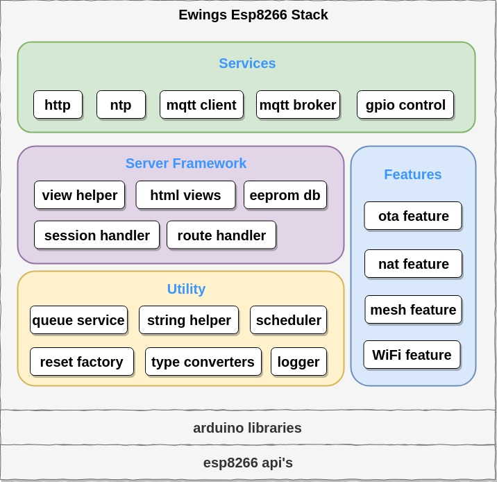

#EwingsEsp8266Stack

Ewings Framework is cover all essential things to build ESP8266 IoT applications easily. 
Basically it is designed on the top of arduino-esp8266 layer to make things easy to understand for developers.

**Ewings Esp8266 Framework Structure**

ESP8266 Wi-Fi SoC offers a complete and self-contained Wi-Fi networking solution. When the ESP8266 hosts application, it boots up directly from an external flash. 
It has an integrated cache to improve the performance of system’s running applications.

ESP8266EX also integrates an enhanced version of Tensilica’s L106 Diamond series 32-bit processor, with on-chip SRAM, on top of its Wi-Fi functionalities. 
It is integrated with external sensors and other application specific devices through its GPIOs. Codes for such applications are provided as examples in the SDK.

The non-OS SDK provides a set of application programming interfaces (APIs) for core ESP8266 functionalities such as data reception/transmission over Wi-Fi, TCP/IP stack functions, hardware interface functions and basic system management functions. 
Thus, the SDK APIs allow programmers to focus on the application under development at a higher level. Users can access all core capabilities of ESP8266 without studying its chip architecture in detail.

Arduino has provided user-friendly libraries that use these SDK APIs at bottom. Since arduino has made its easy iot development environment impact over developers, it's easy for them to develop applications with Arduino ide.
Ewings framework comes on the top of these Arduino libraries. So the whole structure looks as shown in the above figure of Ewings Esp8266 Structure.

**Services**

Ewings provides some basic services that required to develop simple iot application. The services are

* **HTTP :**
The application can use this rest API service to make HTTP requests such as get, post, etc.
 
* **NTP :**
This service provides network time to the application.
 
* **MQTT :**
This lightweight messaging protocol can be used to monitor or operate device itself or sensors that are connected to the device.
 
* **GPIO :**
GPIOs are actually going to interact with sensors. We can read sensor or we can drive appliances with the help of this GPIO services.

**Server**

Esp8266 has built in WiFi feature that work in both station as well as access point mode. Station mode is mode using which we can connect to other wifi network. Access point mode is mode using which Esp8266 create its own network.
Ewings has provided a local http server facility using access point mode of esp8266. By default this server has setting, monitor pages added. It has following components

* **Session Handler :**
Session handler takes care of login sessions. By default, login session expire after 5 minutes.
 
* **Route Handler :**
This handles routing operations of the server. It calls a specific method in route controller based on request URL.
 
* **EEPROM Database :**
Esp8266 has software eeprom library that actually uses space in flash memory to store Ewings framework related config data. Server uses this database to fetch and view settings and control panel of device.
 
* **View Helpers :**
These helpers help to dynamically creates html tags based on data from database.
 
* **Views :**
These are static html pages that split into header, middle and footer sections. At the time of sending http response we gathers them to form a complete html page.

**Features**

Esp8266 has many built in features that will be useful in network applications. Those features are added with Ewings Framework structure.

* **OTA :**
Over The Air (OTA) feature has ability to update the device firmware remotely. By default OTA configurations are accessible with local server.
 
* **NAT :**
Network address translation (NAT) is a method of remapping one IP address space into another by modifying network address information in the IP header of packets while they are in transit across a traffic routing device. With this feature we can extend station network ( network that has active internet ) range.
 
* **MESH :**
This feature is not yet developed. The basic motive to bring this feature is connectivity.

**Utilities**

This common section is made to support/help all other section in their operations. This section consists of some most vital libraries that enable services to run in background/periodically. This section is the base for all other section hence all other services are dependent on this section.

* **Queue :**
Queue is dynamic service which enables users to push any data in it and pop it later for use.
 
* **String Helpers :**
String Helpers helps the user in many string related operations like finding, replacing, JSON parsing, etc.
 
* **Scheduler :**
Scheduler enables the feature of scheduling many things that executes later once or every time on specific intervals.
 
* **Reset Factory :**
This helps to reset the whole device to its default settings in case of device malfunctioning badly. By continuously pressing flash key on device for about 10 seconds this service resets all settings to its default one.
 
* **Data Type Converters :**
As name clears the purpose of this utility. It just used to convert the data types from one to another like integer to string and vice versa.
 
* **Logger :**
Logger enables log on uart0 pins at 9600 baud rate. This is useful in case of debugging application flow.

to enable napt ( network address & port transform ) feature
rename ".....esp8266/tools/sdk/lwip" with ".....esp8266/tools/sdk/lwip.org" and copy lwip folder ( in this repo ) there.
